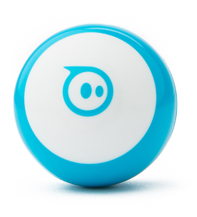

# Gophercon 2025 Hardware Hack Session

The is the repository for the hardware hack session at Gophercon 2025.

https://www.gophercon.com/

### Please return all equipment when you are finished for the next person. Thank you!

## Installation

Please read our [installation instructions here](./INSTALL.md).

## Activities

### TinyGo IoT sensors

Looking for the true "parts experience"? Got you covered! We have brought some Arduino Nano RP2040 Connect IoT microcontroller boards for each person to use for the activity.

https://store.arduino.cc/collections/boards/products/arduino-nano-rp2040-connect

These can be programmed using TinyGo.

There are some Grove sensor kits that you can use for the activity.

Ready to try this out? Go to [./sensor/arduino/](./sensor/arduino/) to get started.

### TinyGo Bluetooth Sensor

This series of tutorials is intended to help you learn about programming Bluetooth devices using TinyGo and the TinyGo Bluetooth package. Using a Arduino Nano RP2040 Connect IoT microcontroller board and tiny display, discover the Bluetooth devices all around us, and make one of your own.

Ready to Go wireless? Click on [./bluetooth/arduino/](./bluetooth/arduino/) to get started.

### Parrot Minidrones

We have Parrot Minidrones you can fly with Go code to control them using their built-in Bluetooth API.

Post in-flight videos using hashtag #gophercon

Ready for takeoff? Go to [https://github.com/hybridgroup/tinygo-minidrone](https://github.com/hybridgroup/tinygo-minidrone).

### WowWee MiP robots

Along for the ride, we brought a couple of WowWee MiP two-wheeled self-balancing robots that you control using Bluetooth.

Post robot videos using hashtag #gophercon

Ready to roll? Go to https://github.com/hybridgroup/tinygo-mip.

### Sphero Mini robots

You need more robots? Of course you do! We brought a few Sphero Mini ball-shaped robots that you control using Bluetooth.

Post robot videos using hashtag #gophercon

Keep on rolling at https://github.com/hybridgroup/tinygo-sphero.

### Skynet

Now you are ready to give some intelligence to the machines with Skynet! Skynet is a lightweight command line interface for LLMs to control real robots and drones using Bash from your own machine.

Post robot videos using hashtag #gophercon

Start the robot takeover at https://github.com/hybridgroup/skynet.

## License

Copyright (c) 2015-2025 The Hybrid Group and friends. Licensed under the MIT license.
